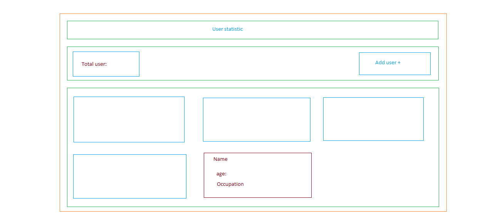

# OverWiew
---

** This is a task from [tapaScript](https://youtu.be/fPBW7Pn6O38?si=NU0Ac9njxhBSBf7q) youtube chanel.It's a *react* amazing react playlist and tutor [Tapas Adhikari](https://x.com/tapasadhikary) sir exlpain in depth and want feedback to give task.This is mainly react jsx tutorial based task and small project with simple ui where a click button to add an anynomous user and a field to show total user and a usr deatils block. It's very easy and interactive.

# Tool and Technology

---

1. Tool
  - VS Code
  - Vite
  - git
2. Technology
  - Javascript
  - React
  - Tailwind CSS
  - HTML

---

# Deployment
This is a fontend application, so my best deployment option is vercel.

- code deploy on github.
- project deploy on vercel.

---

# how to run this Project
 step-1:

go to terminal and write this command to clone source code 
    ``` git clone https://github.com/rashed-mia/react-e-hatekhori-task-4.git```

step-2:

 to go the project repository  write 
     ``` cd task-04```

 step-3:

 to install dependencies write 
    ``` npm install```

 step-4:

 to run the code write 
     ``` npm run dev```

---

# Screenshorts

**Applicatio Ul**
---



**component breakdown diagram**
---


**component hierarchy diagram**
---


**final Ui**
---


# links

source code: [github link](https://github.com/rashed-mia/react-e-hatekhori-task-4.git)

live project: [vercel deployment link](https://react-e-hatekhori-task-4.vercel.app/)

